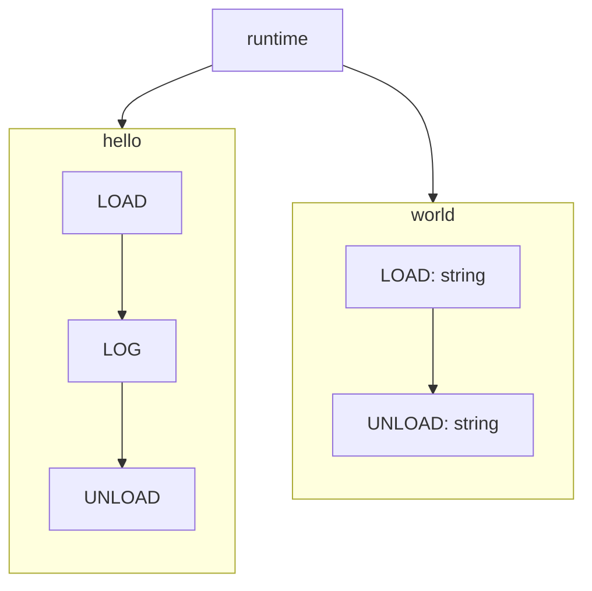

<p align="center">
	
</p>

<h3 align="center">Write Code and visually design architecture</h3>

https://github.com/user-attachments/assets/18c34417-b822-4af5-a133-213075acf68b


<p align="center">
	<a href="https://try.metz.sh">Try in Playground</a>
	·
	<a href="https://docs.metz.sh">Manual</a>
	·
	<a href="https://metz.sh">Home</a>
</p>

# Simulacrum
It's a React based core sdk that powers [metz.sh](https://metz.sh), which lets you express complex engineering designs using code.

### Mental Model
Currently available tools which convert code to diagrams, ask you to solve the problem of where to place a box and how to draw a line. But with metz, you write code only to solve your design problem, nothing else.

For example, let's say you are building a system which has a polling mechanism and it fetches data from one database and updates another. You shouldn't have to write code to create a box for a poller.
You should be writing code ***FOR*** a poller.

So you might come up with a design that can say:
1. For a particular condition, check if database contains what we are looking for. Update it and retrieve it.
2. If we do get something from first step, add it to another database.

And with metz, the code will look like:
```typescript poller.ts

class Poller {
    private ordersTable = new OrdersTable();
    private pollingCollection = new PollingCollection();

    poll() {
        // Step 1
        const updatedOrder = this.ordersTable.updateOne(
            {
                status: 'processing'
            },
            order => order.status === 'pending'
        );

        // Step 2
        if(!updatedOrder) {
            return;
        }

        this.pollingCollection.insert({
            id: `poll_${updatedOrder.id}`,
            order_id: updatedOrder.id
        });
    }

}
```
Check out the how it renders and the full example [here](https://app.metz.sh/template/4).

## How does it work?
It's a react component with an IDE, a compiler and a runtime all working together.

Our compiler converts your code into something that can emit our instructions, or to be precise, can `yield` an instruction.

Sounds fancy, except our instructions are really simple:
```typescript
export enum MethodRuntimeCommands {
	LOAD = 'load',
	LOG = 'log',
	UNLOAD = 'unload',
	HALT = 'halt',
	NO_OP = 'no_op',
	AWAIT_FLOW = 'await_flow',
}
```
Here's a more precise statement:

> Our compiler converts your code into state machines, where each instruction represents a state.
> <br/>And in turn, the runtime manages all these state machines and their transitions.

Take this code for example:
```typescript
class Main {
    /**
     * Is reponsible for many important things.
    */
    hello() {
        const result = this.world('Hello');
        std.log(result);
    }

    /**
     * Does all the heavy lifting!
    */
    world(arg: string) {
        return `${arg} World!`
    }
}
```
Here's a simplistic view of what it looks like after transformation:


The runtime maintains a number internally, called `currentTick`. It also has a function called `tick()` whose job is to get all the available state machines, and make them transition, together.

When the combined transition of all the state machines is complete, `currentTick` is incremented. Here's the [code](https://github.com/metz-sh/simulacrum/blob/328eaf731a4b296e1e6101bb9e2444802a9f60f1/src/runtime/runtime.ts#L216) if you want to check it out. Or read the [manual](https://docs.metz.sh/runtime#runtime) for more.

## How to set up?
Install all the dependencies using:
```bash
yarn install
```

And once done, you can use [Storybook](https://storybook.js.org/) to start playing with the SDK. Simply run:
```bash
yarn storybook
```
This will start running the storybook app on port `6006`. Head over to [http://localhost:6006](http://localhost:6006) to access all stories.


## Next Steps
Check out the [manual](https://docs.metz.sh) to dig deep into the fundamental concepts and inner workings.

Feel free to join our [slack](https://metzcommunity.slack.com/join/shared_invite/zt-1xr4ooes0-AhIP47ENEqrKmnfpCw6e8Q#/shared-invite/email) if you have any question.

Or simply start playing with it in the [playground](https://try.metz.sh)!
