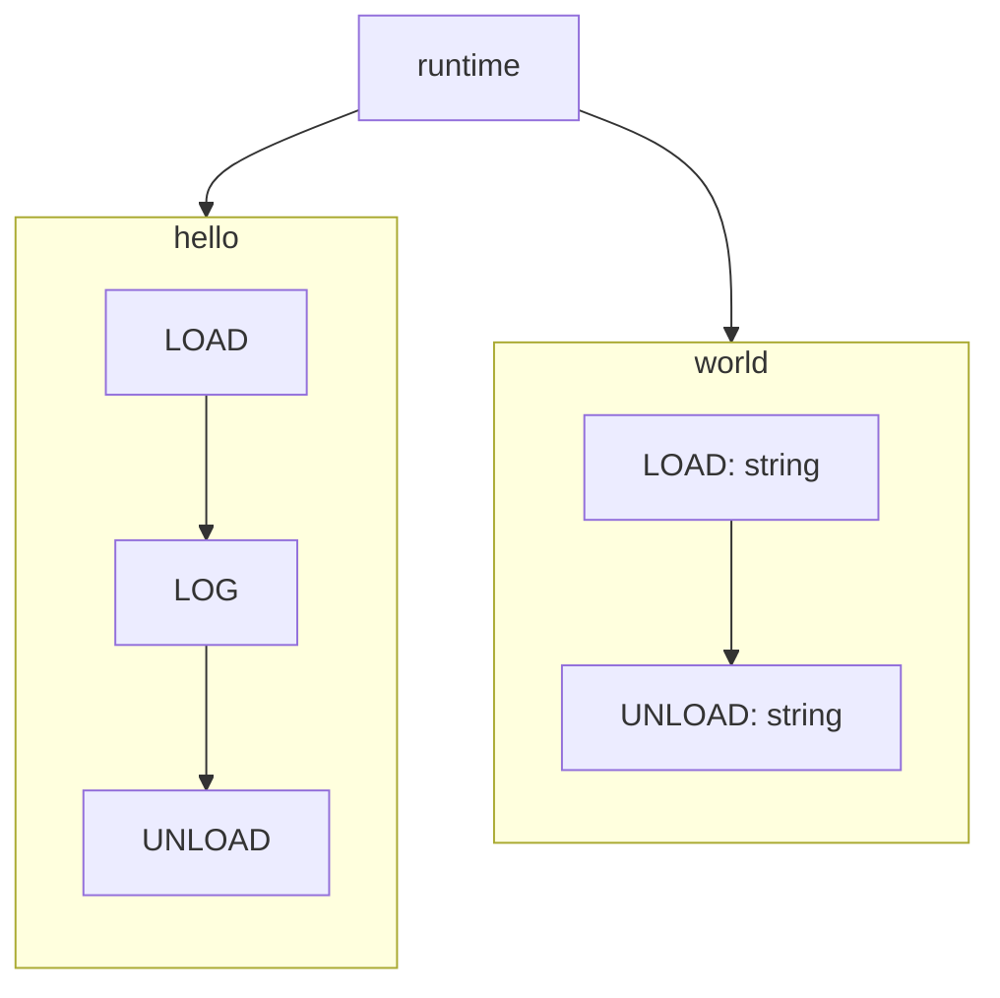

# Simulacrum
It's a react based code playground, where you can write TypeScript code and the bundled runtime will execute that code visually. 
<br/>It's a self sustained package and doesn't need any server. All the compilation and execution happens in the browser itself

The complexity around designing a system or software is usually expressed through underwhelming tools. We are used to dragging and dropping boxes, or sometimes use code to automate that.

With `simulacrum`, you design using code. And you write code only to solve the design problem and nothing else.


https://github.com/user-attachments/assets/18c34417-b822-4af5-a133-213075acf68b


<p align="center">
	<a href="https://try.metz.sh">Try in Playground</a>
	·
	<a href="https://docs.metz.sh">Docs</a>
	·
	<a href="https://metz.sh">Home</a>
</p>


## Mental Model
Say you are building a system which has a polling mechanism and it fetches data from one database and updates another. You shouldn't have to write code to create a box for a poller.
You should be writing code ***FOR*** a poller.

So you might come up with a design like:
1. For a particular condition, check if database contains what we are looking for. Update it and retrieve it.
2. If we do get something from first step, add it to another database.

With metz, this is what the code for a poller will look like:
```typescript poller.ts

class Poller {
    private ordersTable = new OrdersTable();
    private pollingCollection = new PollingCollection();

    poll() {
        // Step 1
        const updatedOrder = this.ordersTable.updateOne(
            {
                status: 'processing'
            },
            order => order.status === 'pending'
        );

        // Step 2
        if(!updatedOrder) {
            return;
        }
	std.log("Got an order!")

	this.pollingCollection.insert({
            id: `poll_${updatedOrder.id}`,
            order_id: updatedOrder.id
        });
    }

}
```
And this is what how the runtime will visualise it:

https://github.com/user-attachments/assets/fefe799a-e1f4-4dfe-b196-5c0a205088f4

## Features
- The runtime executes your code on an internal tick, which essentially acts as time. So a method call might happen on `tick=1` and a message might be logged at `tick=2`.
  - Which means you simulate hard to create scenarios, like multiple things happening at the same time.
- Data gets rendered as a first class citizen. You can design your system along with the data.
  - More importantly, you can show how the data changes throughout a flow.
- You don't just write code. You write stories to tell how the code should be executed.
  - Stories enable you to view your design from different vantage points.

There are so many more cool features. And you can find all of them in our [documentation](https://docs.metz.sh)!

## How does it work?
The IDE is backed by [monaco](https://github.com/microsoft/monaco-editor) and we run the typescript compiler using [vfs](https://www.typescriptlang.org/dev/typescript-vfs/) on a web worker.

When compiling we run the code through our [transformer](https://github.com/metz-sh/simulacrum/blob/575db4193aeb378dd809af97bf6bd938e3892039/src/compiler/command-handlers/build-command/build-command-handler.ts#L107), which in turn converts the code into state-machines.

To be precise, it converts your code into [AsyncGenerators](https://developer.mozilla.org/en-US/docs/Web/JavaScript/Reference/Global_Objects/AsyncGenerator) where the generator yields one of our instructions.

Sounds fancy, except our instructions are really simple:
```typescript
export enum MethodRuntimeCommands {
	LOAD = 'load',
	LOG = 'log',
	UNLOAD = 'unload',
	HALT = 'halt',
	NO_OP = 'no_op',
	AWAIT_FLOW = 'await_flow',
}
```

In turn, the runtime manages all these state machines and their transitions.
Take this code for example:
```typescript
class Main {
    /**
     * Is reponsible for many important things.
    */
    hello() {
        const result = this.world('Hello');
        std.log(result);
    }

    /**
     * Does all the heavy lifting!
    */
    world(arg: string) {
        return `${arg} World!`
    }
}
```
Here's a simplistic view of what it looks like after transformation:


The runtime maintains a number internally, called `currentTick`. It also has a function called `tick()` whose job is to get all the available state machines, and make them transition, together.

When the combined transition of all the state machines is complete, `currentTick` is incremented. Here's the [code](https://github.com/metz-sh/simulacrum/blob/328eaf731a4b296e1e6101bb9e2444802a9f60f1/src/runtime/runtime.ts#L216) if you want to check it out. Or you can read the [docs](https://docs.metz.sh/runtime#runtime) for more.

### How does it render?
The runtime comes with a heap and stack. Every object that your code creates is registered with the heap, and every method call is recorded on the stack.
The visualisation is simply a rendering of how the heap and stack evolve.
For example, if a method calls another, then it'd be reflected on the stack. And this particular state, will be rendered as
the signal moving from one node to another on the playground.

## Examples
- [Hello world](https://app.metz.sh/template/2) 
- [Simple auto scaler](https://app.metz.sh/template/3): Dynamically adds servers when demand surges.
- [Average stock price](https://app.metz.sh/template/7): Uses event emitters to publish prices, and calculates the average in another component.
- [An event bus](https://app.metz.sh/template/6): Show how you could design a central event bus in your own system.
- [A polling setup](https://app.metz.sh/template/4): Shows how data interacts with parallel and scheduled flows.
- [A system mid migration](https://app.metz.sh/template/5): Shows how you can `await` and compose flows.

## How to set up?
Install all the dependencies using:
```bash
yarn install
```

And once done, you can use [Storybook](https://storybook.js.org/) to start playing with the SDK. Simply run:
```bash
yarn storybook
```
This will start running the storybook app on port `6006`. Head over to [http://localhost:6006](http://localhost:6006) to access all stories.

## Off the shelf usage
You can use the [app](https://app.metz.sh) and embed your diagrams anywhere you want.
For example:
```html
<iframe
  width="1200"
  height="1200"
  src="https://app.metz.sh/play/0286b754d9e4408ba172e344eeac47b9">
</iframe>
```


## Next Steps
Check out the [docs](https://docs.metz.sh) to dig deep into the fundamental concepts and inner workings.

Feel free to join our [slack](https://metzcommunity.slack.com/join/shared_invite/zt-1xr4ooes0-AhIP47ENEqrKmnfpCw6e8Q#/shared-invite/email) if you have any question.

Or simply start playing with it in the [playground](https://try.metz.sh)!
